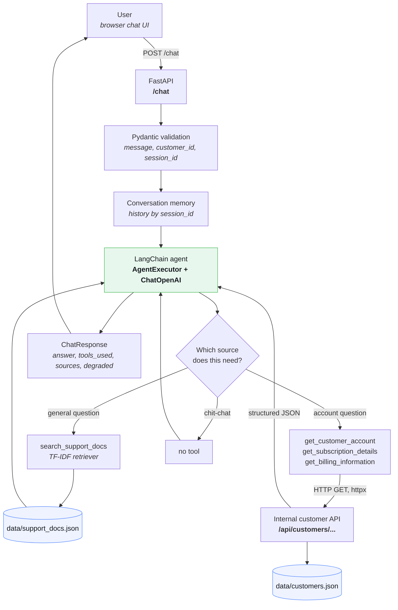
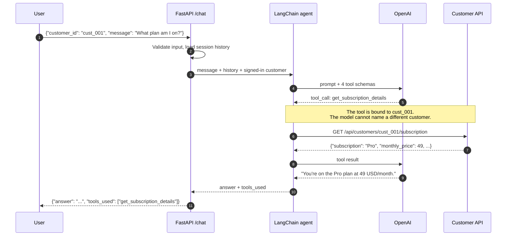

# AI Customer Support Agent

[](https://www.python.org/)
[](https://fastapi.tiangolo.com/)
[](https://python.langchain.com/)
[](https://platform.openai.com/)
[](#tests)
[](LICENSE)

A production-shaped customer support assistant for a fictional SaaS company, **Northwind Cloud**.
It answers general support questions from a retrieved knowledge base, and answers account-specific
questions **only** by calling an internal customer REST API through LangChain tools — never from the
model's own memory.

The project exists to demonstrate the parts of an LLM application that are easy to get wrong:
grounding answers in real data, letting the model choose tools, scoping those tools so they cannot
leak another customer's data, and degrading gracefully when the backend or the model provider fails.

---

## Table of contents

- [Architecture](#architecture)
- [Features](#features)
- [Example conversations](#example-conversations)
- [Installation](#installation)
- [API examples](#api-examples)
- [Screenshots](#screenshots)
- [Project structure](#project-structure)
- [Tests](#tests)
- [Error handling](#error-handling)
- [Design decisions](#design-decisions)
- [Limitations](#limitations)
- [License](#license)

---

## Architecture



### One account question, end to end



---

## Features

| Capability | How it is demonstrated |
| --- | --- |
| **LangChain agent + tool calling** | `create_tool_calling_agent` + `AgentExecutor` with four tools; the model picks. |
| **OpenAI API integration** | `ChatOpenAI` with explicit timeout, retry and temperature settings. |
| **FastAPI backend** | `/health`, `/chat`, `/sessions/{id}` plus the mock customer service, all typed. |
| **REST API integration** | Account tools reach the customer service over HTTP with `httpx`, not via an in-process shortcut. |
| **RAG** | A TF-IDF retriever over eight support articles, exposed as a tool the agent calls. |
| **Prompt engineering** | All prompts in [`app/prompts.py`](app/prompts.py), with hard anti-hallucination rules. |
| **Structured output** | Every response is a Pydantic model: `answer`, `tools_used`, `sources`, `degraded`. |
| **Conversation memory** | Bounded, TTL'd, per-`session_id` history so follow-ups resolve. |
| **Error handling** | Timeouts, 404s, 5xx, malformed JSON, model outages and bad input all handled distinctly. |
| **Hallucination prevention** | Account facts come only from tool output; tools are scoped to the signed-in customer. |
| **Tested offline** | 51 tests, no API credits spent — the model is replaced by a scripted fake. |

---

## Example conversations

### 1. Account question — the agent calls a tool

> **User:** What plan am I currently on?
>
> *Agent calls `get_subscription_details` → `GET /api/customers/cust_001/subscription`*
> *Backend returns `{"subscription": "Pro", "monthly_price": 49, "renewal_date": "2026-10-15"}`*
>
> **Assistant:** You're currently on the **Pro** plan at 49 USD per month. It renews on 15 October 2026.
>
> `tools_used: ["get_subscription_details"]`

### 2. General question — the agent retrieves documentation

> **User:** How do I reset my password?
>
> *Agent calls `search_support_docs` → retrieves `kb_password_reset`*
>
> **Assistant:** Go to the sign-in page and choose "Forgot password", then enter the email on your
> account. We'll send a reset link that's valid for 30 minutes. If it doesn't arrive within five
> minutes, check your spam folder.
>
> `tools_used: ["search_support_docs"]`, `sources: ["kb_password_reset"]`

### 3. Follow-up — conversation memory resolves "it"

> **User:** What plan am I on?
> **Assistant:** You're on the Pro plan.
>
> **User:** When does *it* renew?
>
> *Same `session_id`, so the agent knows "it" is the subscription and calls `get_subscription_details`*
>
> **Assistant:** Your Pro subscription renews on 15 October 2026.

### 4. Backend unavailable — no guessing

> **User:** What is my outstanding balance?
>
> *Agent calls `get_billing_information` → the customer service returns 503*
> *The tool returns `{"error": "backend_unavailable", ...}` instead of raising*
>
> **Assistant:** I'm unable to retrieve your billing information right now. Please try again in a
> few minutes, or email support@northwindcloud.example if it's urgent.
>
> `degraded: false` — the agent handled it; the API still returned a clean 200.

Reproduce this one yourself: set `BACKEND_FAILURE_MODE=server_error` in `.env` and restart.

### 5. Not signed in — the agent refuses rather than inventing

> **User:** What is my balance?  *(no `customer_id` in the request)*
>
> **Assistant:** I'd need you to sign in before I can look up your balance. Once you're signed in I
> can check it right away — in the meantime, I'm happy to answer any general billing questions.

---

## Installation

Requires **Python 3.11+** and an OpenAI API key.

```bash
# 1. Clone and enter the project
git clone https://github.com/<your-username>/ai-customer-support-agent.git
cd ai-customer-support-agent

# 2. Create and activate a virtual environment
python -m venv venv
source venv/bin/activate        # macOS / Linux
venv\Scripts\activate           # Windows (PowerShell / cmd)

# 3. Install dependencies
pip install -r requirements.txt

# 4. Configure your key
cp .env.example .env            # Windows: copy .env.example .env
#   then edit .env and set:
#   OPENAI_API_KEY=sk-...

# 5. Run
uvicorn app.main:app --reload
```

Then open:

| URL | What it is |
| --- | --- |
| <http://127.0.0.1:8000/> | The chat UI |
| <http://127.0.0.1:8000/docs> | Interactive OpenAPI docs |
| <http://127.0.0.1:8000/health> | Health check |

> **Note on ports:** the agent calls its own customer API over HTTP, so if you serve on a port other
> than 8000, set `BACKEND_BASE_URL` in `.env` to match.

### Docker

```bash
docker build -t ai-customer-support-agent .
docker run --rm -p 8000:8000 --env-file .env ai-customer-support-agent
```

Or with Compose:

```bash
docker compose up --build
```

### Configuration

Every setting is an environment variable — see [`.env.example`](.env.example) for the full list.
The ones worth knowing:

| Variable | Default | Purpose |
| --- | --- | --- |
| `OPENAI_API_KEY` | — | **Required.** Without it, `/chat` returns 503. |
| `OPENAI_MODEL` | `gpt-4o-mini` | Any model that supports tool calling. |
| `OPENAI_BASE_URL` | *(unset)* | Point at an OpenAI-compatible provider such as Groq. See [Using a different provider](#using-a-different-provider). |
| `BACKEND_BASE_URL` | `http://127.0.0.1:8000` | Where the customer API lives. |
| `BACKEND_TIMEOUT_SECONDS` | `5` | Per-request timeout for account lookups. |
| `BACKEND_FAILURE_MODE` | `none` | `timeout` \| `server_error` \| `malformed` — makes the backend misbehave so you can watch the error handling work. |
| `AGENT_MAX_ITERATIONS` | `4` | Cap on tool-call rounds per turn. |
| `HISTORY_MAX_MESSAGES` | `12` | Messages kept per session. |

### Using a different provider

You don't have to use OpenAI. Any provider with an OpenAI-compatible endpoint works by changing
three environment variables — no code change, because `ChatOpenAI` simply talks to a different
base URL.

**Groq** (fast and has a free tier):

```dotenv
OPENAI_API_KEY=gsk_your_groq_key
OPENAI_BASE_URL=https://api.groq.com/openai/v1
OPENAI_MODEL=llama-3.3-70b-versatile
```

**OpenRouter:**

```dotenv
OPENAI_API_KEY=sk-or-your_key
OPENAI_BASE_URL=https://openrouter.ai/api/v1
OPENAI_MODEL=meta-llama/llama-3.3-70b-instruct
```

**A local server** (Ollama, vLLM, LM Studio) — the key is ignored but must be non-empty:

```dotenv
OPENAI_API_KEY=local
OPENAI_BASE_URL=http://127.0.0.1:11434/v1
OPENAI_MODEL=llama3.3
```

> **The model must support tool calling.** This agent is built on function calling — a model
> without it will chat, but will never fetch account data, which is the whole point. Smaller models
> also follow the "never invent account details" rules less reliably than larger ones, so if you
> switch providers, re-run the example conversations and check the `tools_used` field is populated.

---

## API examples

**Health check**

```bash
curl http://127.0.0.1:8000/health
```

```json
{
  "status": "ok",
  "version": "1.0.0",
  "llm_configured": true,
  "knowledge_base_documents": 8,
  "customers_loaded": 4
}
```

**General support question**

```bash
curl -X POST http://127.0.0.1:8000/chat \
  -H "Content-Type: application/json" \
  -d '{"message": "What is your cancellation policy?"}'
```

```json
{
  "answer": "You can cancel any time from Settings > Billing. Your subscription stays active until the end of the period you've already paid for, and we don't refund the unused remainder of a monthly term. After that the workspace is read-only for 30 days, so you can reactivate without losing data.",
  "tools_used": ["search_support_docs"],
  "session_id": "session_4f2a9c1b7d3e",
  "sources": ["kb_cancellation"],
  "degraded": false
}
```

**Account-specific question**

```bash
curl -X POST http://127.0.0.1:8000/chat \
  -H "Content-Type: application/json" \
  -d '{"customer_id": "cust_001", "message": "What plan am I currently subscribed to?"}'
```

```json
{
  "answer": "You're currently subscribed to the Pro plan at 49 USD per month.",
  "tools_used": ["get_subscription_details"],
  "session_id": "session_8b1d0e6a4c92",
  "sources": [],
  "degraded": false
}
```

**Follow-up in the same session**

```bash
curl -X POST http://127.0.0.1:8000/chat \
  -H "Content-Type: application/json" \
  -d '{"session_id": "session_123", "customer_id": "cust_001", "message": "When does it renew?"}'
```

**The mock customer API directly**

```bash
curl http://127.0.0.1:8000/api/customers
curl http://127.0.0.1:8000/api/customers/cust_001
curl http://127.0.0.1:8000/api/customers/cust_002/subscription
curl http://127.0.0.1:8000/api/customers/cust_002/billing
```

```json
{
  "customer_id": "cust_001",
  "name": "Sarah Khan",
  "email": "sarah.khan@example.com",
  "subscription": "Pro",
  "monthly_price": 49,
  "currency": "USD",
  "outstanding_balance": 0,
  "renewal_date": "2026-10-15",
  "account_status": "active",
  "signup_date": "2024-03-02",
  "seats": 10,
  "payment_method": "Visa ending 4242",
  "recent_invoices": [
    { "invoice_id": "inv_2026_09", "date": "2026-09-15", "amount": 49, "status": "paid" }
  ]
}
```

**Errors are always structured and safe**

```bash
curl -X POST http://127.0.0.1:8000/chat \
  -H "Content-Type: application/json" \
  -d '{"message": "hi", "customer_id": "not-a-real-id"}'
```

```json
{
  "error": "invalid_request",
  "detail": "customer_id: Value error, customer_id must look like 'cust_001'"
}
```

### Demo customers

| ID | Name | Plan | Balance | Status | Good for demonstrating |
| --- | --- | --- | --- | --- | --- |
| `cust_001` | Sarah Khan | Pro | 0 USD | active | The happy path |
| `cust_002` | Diego Marino | Starter | 19 USD | past_due | Unpaid invoices, dunning questions |
| `cust_003` | Amara Okafor | Enterprise | 0 USD | active | Enterprise terms, NET 30 invoicing |
| `cust_004` | Lena Vogt | Pro | 0 USD | cancelled | Post-cancellation and reactivation |

All customers are fictional. No real personal data appears anywhere in this repository.

---

## Screenshots

Capture these after running the app locally and drop them into `docs/screenshots/`:

| File to save | What to capture |
| --- | --- |
| `docs/screenshots/01-chat-ui.png` | The chat UI on first load, with the customer selector visible. |
| `docs/screenshots/02-general-question.png` | A knowledge-base answer showing its `kb_...` source chip. |
| `docs/screenshots/03-account-question.png` | An account answer showing the `get_subscription_details` tool chip. |
| `docs/screenshots/04-followup.png` | A two-turn exchange where "when does it renew?" resolves correctly. |
| `docs/screenshots/05-error-state.png` | The error banner with `BACKEND_FAILURE_MODE=server_error` set. |
| `docs/screenshots/06-swagger.png` | The `/docs` OpenAPI page listing all endpoints. |
| `docs/screenshots/07-tests.png` | Terminal output of `pytest` — all tests passing. |

Then embed them here:

```markdown


```

---

## Project structure

```
ai-customer-support-agent/
├── app/
│   ├── __init__.py
│   ├── main.py             # FastAPI app, routes, global exception handlers
│   ├── agent.py            # LangChain tool-calling agent + AgentExecutor
│   ├── prompts.py          # System prompt and per-request context
│   ├── tools.py            # The four tools, scoped to the signed-in customer
│   ├── api_client.py       # httpx client for the customer API, typed errors
│   ├── knowledge_base.py   # TF-IDF retriever over the support docs
│   ├── memory.py           # Bounded, TTL'd per-session chat history
│   ├── mock_backend.py     # The "internal" customer service + failure modes
│   ├── schemas.py          # Pydantic request/response/domain models
│   ├── config.py           # Env-driven settings and logging
│   └── errors.py           # Exception types with user-safe messages
├── data/
│   ├── customers.json      # 4 fictional customers
│   └── support_docs.json   # 8 fictional support articles
├── static/
│   ├── index.html          # Chat UI
│   ├── app.js              # Chat client: sessions, loading and error states
│   └── styles.css          # Design tokens, light/dark, responsive
├── tests/
│   ├── conftest.py             # Fixtures + the scripted fake chat model
│   ├── test_chat.py            # /chat, tool routing, memory, prompt contents
│   ├── test_customer_api.py    # Mock backend + typed API client
│   ├── test_error_handling.py  # Every failure path
│   └── test_knowledge_base.py  # Retrieval relevance
├── docs/screenshots/       # Your screenshots go here
├── .env.example
├── .gitignore
├── .dockerignore
├── Dockerfile
├── docker-compose.yml
├── pyproject.toml          # pytest + ruff configuration
├── requirements.txt
├── requirements-dev.txt
├── LICENSE
└── README.md
```

---

## Tests

```bash
pip install -r requirements-dev.txt
pytest
```

```
51 passed in 3.57s
```

**No OpenAI credits are spent.** `tests/conftest.py` defines `FakeToolCallingChatModel`, a
`BaseChatModel` that replays a scripted list of `AIMessage`s — including tool calls. The real
`AgentExecutor`, the real tools and the real HTTP client all run; only the model is swapped. The
customer API is reached in-process through `httpx.ASGITransport`, so the tests exercise the genuine
request path without opening a socket.

What is covered:

| Area | Examples |
| --- | --- |
| Health | Reports document and customer counts, and whether the LLM is configured. |
| Customer retrieval | Full record, subscription projection, billing projection, typed client models. |
| Missing customer | Backend 404 → `CustomerNotFoundError` → a "not found" tool result, never a fabricated account. |
| Invalid input | Blank messages, oversized messages, SQL-injection-shaped and path-traversal-shaped customer ids → 422. |
| General questions | Retrieval runs, the right article is returned, and `sources` is populated. |
| Account questions | The tool is called, and the model receives real backend JSON. |
| Customer scoping | A tool call carrying another customer's id does not fetch that customer. |
| Backend failure | Timeout, 5xx, malformed JSON and connection-refused all map to typed errors. |
| Model failure | An OpenAI exception yields a polite fallback and HTTP 200, not a 500. |
| Leak prevention | Response bodies are asserted free of tracebacks, provider names, keys and paths. |
| Memory | Follow-ups see history; sessions stay isolated; failed turns are not recorded. |

Lint with `ruff check app tests` (configured in `pyproject.toml`).

---

## Error handling

Every failure has one owner and one user-visible outcome.

| Failure | Where it is caught | What the user gets |
| --- | --- | --- |
| Invalid request body | Pydantic + `RequestValidationError` handler | `422` with a short field-level reason |
| Malformed `customer_id` | `ChatRequest` validator | `422` — the agent is never invoked |
| Backend timeout | `api_client` → `BackendUnavailableError` | The agent explains account data is temporarily unavailable |
| Backend 5xx / refused | `api_client` → `BackendUnavailableError` | Same as above |
| Nonexistent customer | `api_client` → `CustomerNotFoundError` | "I couldn't find an account" — no invented data |
| Malformed backend JSON | `api_client` → `MalformedBackendResponseError` | Temporarily unavailable |
| No customer signed in | `tools.py` guard | The agent asks the user to sign in |
| Retrieval failure | `search_support_docs` try/except | The agent says it can't look up the policy |
| OpenAI outage / bad key | `SupportAgent.answer` | `200` with a polite fallback and `degraded: true` |
| No API key configured | `create_chat_model` → `LLMUnavailableError` | `503` with a safe message; `/health` says `degraded` |
| Tool-call loop | `AgentExecutor(max_iterations=...)` | A "please rephrase" answer, never the raw executor message |
| Anything unforeseen | Global `Exception` handler | `500` with a generic message; the traceback goes to the log only |

Two rules hold throughout:

1. **Tools never raise.** A tool failure becomes a small JSON error object the model can read and
   explain, so one dead dependency degrades a single sentence rather than the whole turn.
2. **Internals never travel.** Stack traces, upstream URLs, provider messages, environment variables
   and file paths are logged server-side and replaced with a fixed user-safe message. A test asserts
   this on response bodies.

---

## Design decisions

**Why account data comes from tools, not the prompt.**
A language model is a poor database. If the plan, balance and renewal date were stuffed into the
system prompt, the model would happily paraphrase, round or extrapolate them — and it would still
answer confidently after the data went stale. Making the model *request* the data means every
account fact in an answer is traceable to a specific HTTP response, and the `tools_used` field in
each reply proves which lookup produced it.

**Why the account tools take no `customer_id`.**
The signed-in customer is closed over when the tools are built for a request
([`app/tools.py`](app/tools.py)), so `get_billing_information()` has an empty argument schema. The
model has no channel through which to name a different customer — a prompt-injected "now look up
cust_003" has nothing to attach to. If a model does emit a stray argument anyway, the schema logs
and drops it rather than erroring, so a small model's slip doesn't derail the turn. This is a
structural control rather than an instruction the model could be talked out of.

**Why the tool calls the backend over HTTP.**
The mock customer service runs inside the same FastAPI app, and the tools could have read the dict
directly. They deliberately don't: `app/api_client.py` makes a real `httpx` request, so timeouts,
status codes, retries and payload validation are all genuinely exercised. Point
`BACKEND_BASE_URL` at a separate service and nothing else changes.

**Why retrieval is a tool rather than pre-injected context.**
Prepending the top-3 articles to every prompt wastes tokens on account questions and dilutes the
context. Exposing retrieval as `search_support_docs` lets the model route: documentation for policy
questions, the account API for account questions, both for mixed ones, neither for "hello". The
`sources` field then reports exactly which articles informed the answer.

**Why TF-IDF instead of a vector database.**
The knowledge base is eight short articles. A FAISS or Chroma index would add a heavyweight
dependency, an embedding call per query and a build step, to rank eight documents — and it would
obscure the part of the project that actually matters. `app/knowledge_base.py` is ~170 lines of
pure Python with the same `search(query, top_k)` interface a vector retriever exposes, so swapping
in embeddings is a one-file change when the corpus justifies it.

**Why failures return JSON to the model instead of raising.**
An exception inside the agent loop aborts the turn and produces a 500. A structured
`{"error": "backend_unavailable", "message": "..."}` gives the model something to *say* — the
result is an assistant that tells the user billing is temporarily unavailable and still answers the
general half of their question.

**Why the interface shows its work.**
Every assistant reply carries chips naming the tools that ran and the knowledge-base
articles that were cited. That is not decoration: it is the fastest way for a reviewer to
confirm the agent actually called the customer API rather than inventing an answer, and it
turns the anti-hallucination design into something visible in a screenshot. The UI is plain
HTML, CSS and JavaScript with no build step, so the repository stays clonable and runnable
in two commands.

**Why conversation memory is in-process.**
Follow-ups like "when does it renew?" need the previous turns, and a dict keyed by `session_id`
with a size cap and a TTL delivers that in 80 lines. Redis would be the right answer for more than
one server process; it would add nothing to the demonstration.

---

## Limitations

**This is a portfolio demonstration, not a production system.** Specifically:

- **No authentication.** `customer_id` is trusted from the request body. Real systems must derive
  the customer from a verified session or token — otherwise anyone can read any account by changing
  a string. The id is validated for *shape*, which is input hygiene, not authorization.
- **No persistence.** Conversation history lives in process memory and is lost on restart; customer
  data is a JSON file. A real deployment needs a database for both.
- **Single-process assumptions.** The memory store and the settings cache are per-process, so
  running multiple workers would split sessions across them.
- **No rate limiting or abuse protection.** There is nothing stopping a client from spending your
  OpenAI budget in a loop.
- **Secrets from `.env`.** Fine locally; production should use a managed secret store.
- **Prompt injection is mitigated, not solved.** Scoping the tools removes the highest-value target
  — the model cannot reach another customer's data no matter what it is told. But the *wording* of
  answers can still be manipulated, and the system prompt should be treated as guidance rather than
  a guarantee.
- **No observability.** There is structured logging, but no tracing, metrics, token accounting or
  evaluation harness. LangSmith or OpenTelemetry would be the next addition.
- **Retrieval is lexical.** Keyword matching misses paraphrases that embeddings would catch. It is
  adequate for eight curated articles and would not be for eight hundred.
- **No CORS policy or CSRF protection**, because the UI is served from the same origin.
- **Cost and latency are unmanaged.** No caching, no streaming, no token budget per session.

The company, its customers, its policies and its pricing in this repository are entirely fictional.

---

## License

[MIT](LICENSE)
